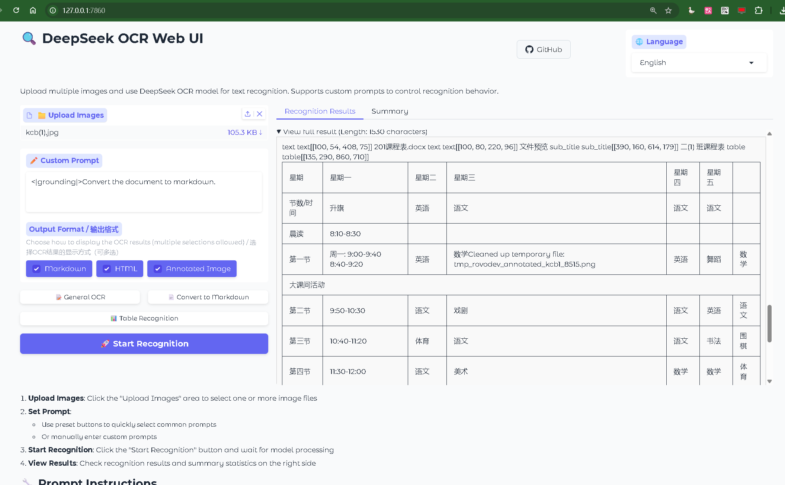

# DeepSeek-OCR WebUI

**语言:** [English](README.md) | [中文](README_zh.md)

A web-based interface for DeepSeek-OCR model.

## 📋 Release Notes

### [2025-01-24] - Enhanced Table Recognition & Visual Annotation
- ✨ **Table Recognition Display**: Added enhanced table structure visualization with markdown formatting
- 🎯 **Image Position Annotation**: Implemented interactive HTML-based coordinate annotation system
  - Color-coded bounding boxes for detected text regions
  - Real-time coordinate legend with precise positioning
  - Multi-format output support (Markdown, HTML, Annotated Image)
  - Responsive design that scales perfectly across all devices

## Quick Start



### 1. Download Model

Download the DeepSeek-OCR model from one of these sources:
- **ModelScope**: https://www.modelscope.cn/models/deepseek-ai/DeepSeek-OCR
- **Hugging Face**: https://huggingface.co/deepseek-ai/DeepSeek-OCR

### 2. Installation Options

#### Option A: Local Installation

1. **Install Dependencies**
   ```bash
   conda create -n deepseek-ocr python=3.12.9 -y
   conda activate deepseek-ocr
   pip install -r requirements.txt
   
   pip install flash-attn==2.7.3 --no-build-isolation
   
   ```

2. **Configure Model Path**
   
   Edit `start_ocr_webui.py` line 26:
   ```python
   # Change this line to your model path
   self.model_path = '/path/to/your/DeepSeek-OCR'
   ```

3. **Run Application**
   ```bash
   python start_ocr_webui.py
   ```

4. **Access WebUI**
   
   Open browser: http://localhost:7860

#### Option B: Docker Deployment

1. **Prepare Model Directory**
   ```bash
   mkdir -p ./models
   # Place your downloaded DeepSeek-OCR model in ./models/DeepSeek-OCR/
   ```

2. **Build and Run**
   ```bash
   docker-compose up -d
   ```

3. **Access WebUI**
   
   Open browser: http://localhost:7860

### 3. Usage

1. Upload one or more images
2. Enter OCR prompt (or use preset prompts)
3. Click "Recognize" button
4. View results in the Results/Summary tabs

## Requirements

- Python 3.12+
- CUDA-compatible GPU (recommended)
- 16GB+ GPU memory 4080+
- PyTorch with CUDA support

## Features

- Multi-image batch processing
- Multiple OCR prompt presets
- Bilingual interface (English/Chinese)
- Docker deployment support
- Real-time processing progress

## Common Prompts

- **General OCR**: `Free OCR.`
- **Markdown**: `<|grounding|>Convert the document to markdown.`
- **Table**: `<|grounding|>Extract all tables and convert to markdown format.`
