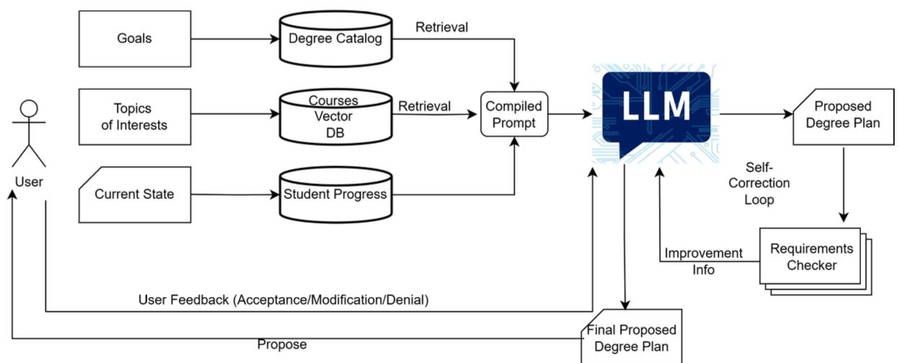

Figure 1: Architecture of the Recommender System Pipeline 
  

models to recommend or offer useful data for a personalized user experience. It also makes the LLM a goal- based agent, ensuring a robust recommendation and personalized user experience.  

To bridge the technical and user- facing aspects of the system, the LLM interprets user prompts and synthesizes outputs from the recommender system into a parsed and formulated interface. The LLM with the checker feedback loop ensures that the recommendations are clear, actionable, and tailored to the user's query. The LLM can also provide reasoning for its choices. It enhances the system's usability by presenting complex academic information in a simplified manner with explanations that students can easily understand, expanding reasoning and customization abilities beyond the traditional recommender system.  

A critical aspect of the system's design is the degree progress checker, which validates all recommendations to ensure compliance with university policies, prerequisite structures, and degree requirements. This component safeguards against invalid or infeasible course selections, ensuring that students can confidently rely on the recommendations to meet their academic goals. Though the logic is often complicated, most universities already use degree progressing tools to ensure their students can graduate with an automated program. If such an automated check does not exist, then manual checking can be supported by an LLM agent who is asked to explain why a proposed degree plan meets all requirements or not.  

Unlike traditional Retrieval- Augmentation Generation (RAG) techniques (Lewis et al. 2021), this recommender system does not check the entire university data into a vector database. It only retrieves relevant user data, degree requirement data, and courses of interest data with minimal vector database retrieval. This novel approach ensures data robustness for generation and guarantees that only relevant data is being offered to the LLM in automation. A traditional RAG  

chatbot may be easier to implement, yet it can lose relevant data or offer unnecessary information to the LLM, causing the LLM to miss important details or hallucinate.  

## Experiment  

There are several metrics to test the performance of the recommender system.  

1. Accuracy: How frequently does the system offer effective and correct recommendations where the proposed plan guarantees student graduation? 
2. Speed: How fast does it take for the system to give an initial proposed plan to the users? How many iterations does it take on average for the user to accept the proposed plan? 
3. Relevancy: How relevant are the recommendations to the student's degree requirements and academic interests?  

Performance vs. Computational Cost Analysis To evaluate the performance and computational efficiency of various LLMs, we present a comparative analysis based on two key metrics: performance score (y-axis) and computational cost (x-axis).  

100 simulated student user data were used to conduct this experiment, where each student pursued random degrees with random topics of interest while completing random courses during the first 1 or 2 semesters of their undergraduate career. These 100 user data were given to various LLMs to get an initial proposal and then sent to the Self- Correction Loop only once to test out the accuracy and efficiency of these models. Since the requirements checker has very complicated logic for each program, we implemented a requirement- checking agent (same model as the initial generating LLM) to prompt the initial LLM requirements that need to be met. Another separate agent is then used to grade the degree plan proposal as pass or fail: pass being the LLM proposed a degree plan that reaches all requirements.